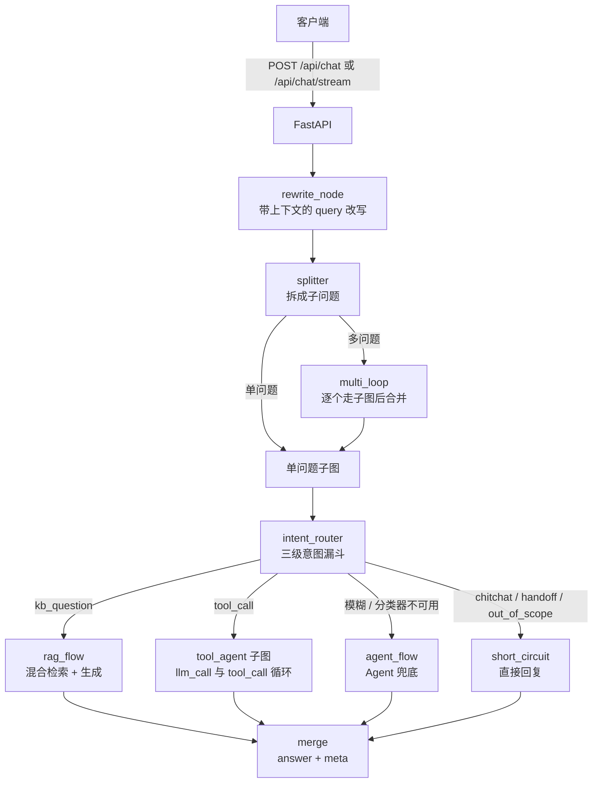
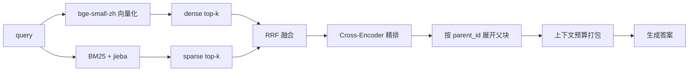

# 智能客服问答 API —— RAG 检索 + Agent 编排

面向智能家居售后场景的问答服务：**文档入库 → 混合检索 → 意图路由 → 生成/工具调用**，支持 SSE 流式输出。

项目重点不在"接一个大模型"，而在**检索质量可度量**与**失败路径可降级**：每个环节都有评估口径、有降级分支、有对应的回归测试。

| | |
|---|---|
| 检索层（165 条正样本标注集） | 精排后 **R@1 84.8% / R@20 98.2% / MRR 0.901** |
| 测试 | **331 个用例全绿**，零外部服务（不连 Redis / MySQL / 任何 LLM） |
| 入库 | 167 份文档 / 1761 个子块 / 98.4 秒，含 2 项安全探针 |
| 技术栈 | FastAPI · LangGraph · Chroma · BM25(jieba) · MySQL · Redis · DashScope · MCP |

---

## 快速开始：克隆下来怎么跑起来

### 0. 前置条件

| 依赖 | 必需性 | 说明 |
|---|---|---|
| Python **3.11+**（实测 3.12） | 必需 | |
| **DeepSeek** + **阿里云百炼 DashScope** 的 API Key | 必需 | 缺了服务**启动即失败**（见第 2 步） |
| 磁盘 ~3 GB | 必需 | 两个本地模型首次运行时自动下载：向量 183MB + 精排 2.4GB |
| MySQL 8 | 建议 | 父块存储 + 文档清单。缺了不会崩，但 small-to-big 的父块扩展会降级 |
| Redis | 建议 | 会话历史 + 转人工计数窗口。缺了只影响这两项 |
| Tesseract OCR | 可选 | 只影响扫描件 PDF / 文档内嵌图的文字识别 |

> **只想跑测试？** 不需要任何 key、不需要 MySQL / Redis、不需要模型 —— 克隆完直接
> `pytest` 就是 **331 个用例全绿**（`tests/conftest.py` 会注入占位 key，所有 LLM 调用都走桩）。
> 想先确认"这套东西是活的"，这是最快的路径。

### 1. 克隆 + 装依赖

```bash
git clone https://github.com/11ddc/agentstudy.git
cd agentstudy

python -m venv venv
venv\Scripts\python.exe -m pip install -r requirements.txt   # Windows
venv/bin/python -m pip install -r requirements.txt           # Linux / macOS
```

用 `uv` 也行（依赖清单与 requirements.txt 一致）：

```bash
uv sync
```

> ⚠️ 两个本地模型（`embbding_models/`、`Reank_models/`）体积太大已 gitignore，
> **仓库里没有**。不需要手动下载：默认路径不存在时会自动退回 HuggingFace 仓库 ID
> （`BAAI/bge-small-zh-v1.5` / `BAAI/bge-reranker-v2-m3`）并走 `hf-mirror.com` 镜像。
> 想放到本地目录也行，把 `EMBEDDING_MODEL_PATH` / `RERANK_MODEL_PATH` 指过去即可。

### 2. 配置 `.env`

```bash
copy .env.example .env      # Windows
cp .env.example .env        # Linux / macOS
```

`.env` 已被 gitignore，**真实 key 不会入库**。整套只涉及 **2 个平台、4 个必需变量**：

| 变量 | 去哪申请 | 用途 |
|---|---|---|
| `DEEPSEEK_API_KEY` | [platform.deepseek.com](https://platform.deepseek.com/api_keys) | 主模型：query 改写 / 意图仲裁 / 兜底 Agent |
| `GENERATE_API_KEY` | [百炼控制台](https://bailian.console.aliyun.com/) | RAG 答案生成（qwen3-32b） |
| `QIAN_WEN_QUERYSTION_API_KEY` | 同上（**可填同一把 key**） | 多问题拆分（qwen3.5-flash） |
| `ZHI_PU_API_KEY` | [open.bigmodel.cn](https://open.bigmodel.cn/) | 工具调用模型（glm-4.5-air） |
| `MYSQL_URL` | 自己起 | 父块存储，格式见模板 |

这 4 个 key 是**在 import 期**就被读走的（`agent/graph.py`、`agent/langchina.py`、
`intent/problemdecomposition.py` 在模块级就构造客户端），所以**缺一个服务都起不来**。
不用担心看堆栈：`main.py` 里加了启动前自检，缺哪个会直接列出来并告诉你去哪填。

> `QIANWEN_API_KEY`（云端向量 + 视觉 OCR）是**可选**的：默认走本地向量 + 本地 OCR，
> 不填也能跑；只有要处理纯图片扫描页、或想换成云端 embedding 时才需要。

### 3. 起 MySQL / Redis（可选，建议）

```bash
# MySQL：建库 + 建表（建表脚本幂等，可重复执行）
mysql -uroot -p -e "CREATE DATABASE rag DEFAULT CHARACTER SET utf8mb4 COLLATE utf8mb4_unicode_ci;"
venv\Scripts\python.exe -m db.init_schema

# Redis：本地起一个即可，默认就连 redis://localhost:6379
docker run -d -p 6379:6379 redis:7
```

两个都没起也能启动，只是对应功能降级（父块扩展 / 会话历史）。

### 4. 灌一份知识库

仓库里不带语料（`knowledge_base/`、`chroma_db/` 都是产物）。用固定 seed 的语料生成器
造一份可复现的：

```bash
# 生成语料（171 份文档 + 1 份 manifest，含 4 个刻意准备的边界样本）
venv\Scripts\python.exe eval\gen\gen_corpus.py --profile L --seed 42

# 先起服务（另一个终端），再批量走真实 HTTP 接口入库
venv\Scripts\python.exe main.py
venv\Scripts\python.exe eval\ingest_corpus.py
```

也可以不用生成器，直接把自己的文档丢进 `knowledge_base/`，或调 `POST /api/upload`。

### 5. 启动

```bash
venv\Scripts\python.exe main.py
```

打开 **http://127.0.0.1:8000/docs** 就是交互式接口文档。主要接口：

| 接口 | 说明 |
|---|---|
| `POST /api/chat` | 一次性问答 |
| `POST /api/chat/stream` | SSE 流式问答 |
| `POST /api/upload` | 上传文档入库 |

> 首次调用检索会加载模型，**冷启动几十秒是正常的**（GPU 加载 2.4GB 精排模型）；
> 之后复用一个进程内单例，不再重复加载。

### 常见问题

| 现象 | 原因 / 处理 |
|---|---|
| 启动直接退出，提示缺 API Key | 照提示把 `.env` 里列出的变量填上；`.env` 得在**项目根目录** |
| 日志出现「重排失败，降级为 RRF 默认顺序」 | 精排模型没加载成功 → 指标会掉。检查 `RERANK_MODEL_PATH` / 显存，或先设 `RERANK_DEVICE=cpu` |
| 日志出现「tiktoken 不可用，改用字符粗估」 | 没装 tiktoken，只是预算估得粗，不影响功能 |
| 检索为空 | 还没入库（第 4 步），或 `knowledge_base/` 是空的。先在 `/docs` 里调 `/api/upload` |
| 上传扫描件 0 块入库 | 需要 OCR：装 Tesseract（+`chi_sim` 语言包），装在非默认位置时用 `TESSERACT_CMD` 指路 |
| 想确认改动没把东西跑坏 | `pytest -q` —— 全绿说明检索/路由/降级路径都正常 |

---

## 它能做什么

- **多格式文档入库**：PDF（含扫描页 OCR 判定）/ DOCX（标题层级、表格窗口、内嵌图 OCR）/ XLSX（表头感知的窗口切分）/ TXT / Markdown，统一切成"父块 + 子块"两级结构。
- **混合检索**：向量召回（dense）+ 关键词召回（BM25），RRF 融合，Cross-Encoder 精排，最后按 `parent_id` 展开成父块 —— 打分用小而准的子块，喂给模型用带章节标题的父块。
- **三级意图漏斗**：规则 → Embedding 相似度 → LLM 结构化输出仲裁；只在歧义时才付出 LLM 的延迟与成本，任一层不可用都能降级而不是整条链失效。
- **Agent 工具调用**：4 个知识库工具（全库检索 / 限定文档检索 / 文档清单 / 章节概览）+ 通过 MCP 接入的外部工具，由 LangGraph 子图完成"调用-观察-再调用"循环。
- **多问题拆分与改写**：带上下文的 query 改写（短查询才触发，单号/型号原样保留）→ 拆成子问题 → 多问题逐个走完整流程后合并。
- **SSE 流式**：检索/生成阶段状态、真 token 增量、"部分内容未走流式"时的重置对账。
- **上下文预算**：按 token 估算打包检索结果，超出预算截断，而不是静默丢给模型触发 400。

---

## 实测效果

### 检索层（可复现）

174 条标注样本（165 正 / 9 负），语料 profile=L（171 个文件，含 4 个刻意准备的边界样本），本地 embedding + 本地精排：

| 通道 | 命中 | R@1 | R@3 | R@5 | R@20 | MRR |
|---|---|---|---|---|---|---|
| dense（bge-small-zh + Chroma） | 120/165 | 41.2% | 53.3% | 57.0% | 72.7% | 0.492 |
| BM25（jieba） | 159/165 | 70.3% | 87.3% | 93.3% | 96.4% | 0.799 |
| RRF 融合 | 162/165 | 52.7% | 77.0% | 89.7% | **98.2%** | 0.676 |
| **+ 精排** | 162/165 | **84.8%** | **93.9%** | **96.4%** | **98.2%** | **0.901** |
| + 父块扩展 | 161/165 | 84.8% | 93.9% | 96.4% | 97.6% | 0.901 |

分桶看精排的价值（R@1，融合后 → 精排后）：

| 分桶 | n | RRF R@1 | 精排 R@1 |
|---|---|---|---|
| 原词（文档里的词） | 9 | 77.8% | 66.7% |
| 口语改写（同义不同词） | 8 | 37.5% | **75.0%** |
| 跨文档（区分相近条目） | 9 | 44.4% | **66.7%** |
| 编号检索（唯一 ID 查找） | 139 | 52.5% | 87.8% |

时延（p50 / p90，毫秒）：向量化 72 / 136 · dense 10 / 14 · BM25 10 / 17 · **精排 1632 / 5882**

> **怎么读这张表（很重要）**
> 1. 融合把 R@20 从 96.4% 拉到 98.2%、补住了 dense 的短板，但 **R@1 反而低于 BM25 单路**（52.7% vs 70.3%）；靠精排把 R@1 拉回 84.8%。也就是说**融合负责召回上限，精排负责排序质量**，两件事不能混着看。
> 2. 精排增益最大的正是两个最难的桶（口语改写 37.5%→75.0%、跨文档 44.4%→66.7%），这正是它该起作用的场景。
> 3. 样本分布偏"编号检索"（139/165），总指标主要由该桶决定；原词/口语改写/跨文档三桶各只有 8~9 条，**只能看趋势，不能当结论**。
> 4. 这一步是**纯检索层**评测，不含生成正确率，也不含路由层。

判定精度是 **chunk 级**而不是文件级：标注集里每条样本都带 `anchor`（必须是该 chunk 原文的精确子串），脚本启动时先校验锚点再算指标 —— 否则一个占 39/53 块的大文件会让 R@20 虚高到接近 1。方法论详见 [`eval/README.md`](eval/README.md)。

### 入库与安全探针

| 项 | 结果 |
|---|---|
| 应当成功的文档 | 167 / 167 全部成功（`failed_expectations` 为空） |
| 子块总数 | 1761 |
| 全量入库耗时 | 98.4 秒 |
| 刻意准备的 4 个边界样本 | 全部按预期表现：截断 PDF 与 GBK 编码文本 → 500 并留痕；空文件 → 200 且 0 块；不支持的格式（`.png`）→ 明确报错而不是静默入库 |
| 安全探针 1：路径穿越（`../../evil.pdf`） | 拒绝（400），知识库外无写入 |
| 安全探针 2：超大文件（51MB，上限 50MB） | 拒绝（413），无残留 `.part` 文件 |

---

## 架构

### 请求编排（LangGraph 三层图）



### 检索链路



### 模块职责

| 目录 | 职责 |
|---|---|
| `api/` | HTTP 接口：`/api/chat`、`/api/chat/stream`（SSE）、`/api/upload` |
| `agent/graph.py` | LangGraph 三层图：主图（改写→拆分→单/多问题）、单问题子图（意图→分支→汇总）、工具子图（LLM⇄工具循环） |
| `intent/` | 三级意图漏斗 + 意图/槽位数据结构 |
| `rag/rag.py` | 解析（PDF/DOCX/XLSX/图内 OCR）、父子切分、双路召回、RRF、精排、父块扩展、入库与状态 |
| `rag/local_embedding.py` · `rag/local_reranker.py` | 本地 embedding 与 Cross-Encoder 精排（懒加载，启动不加载 torch） |
| `query_rewrite/` | 改写（带会话历史、短查询闸门）+ Redis 历史读写 |
| `tools_agent/` | 知识库工具（4 个）+ 工具调用模型 + 工具分派 |
| `context_budget.py` | token 估算、预算打包、溢出识别 |
| `db/` · `redis_client.py` | MySQL 文档/父子块存储 · Redis 会话历史与转人工计数窗口 |
| `mcp_client.py` | 外部 MCP 服务接入，工具统一命名空间 `mcp__<server>__<tool>` |
| `eval/` | 语料生成器（固定 seed）、批量入库、检索召回评测脚本 |
| `tests/` | 331 个用例，全部零外部服务 |


## 目录结构

```
my-agent-api/
├── main.py                 # 入口（uvicorn 127.0.0.1:8000）+ 启动前 .env 自检
├── config.py               # 配置集中入口（模型路径 / Chroma / Redis / OCR）
├── context_budget.py       # token 预算与打包
├── mcp_client.py           # MCP 外部工具接入
├── .env.example            # 环境变量模板（复制成 .env 后填 key）
├── requirements.txt        # 运行依赖（pip）
├── pyproject.toml          # 同一份依赖（uv），与 requirements.txt 保持同步
├── router/                 # 路由注册
├── api/                    # chat / chat_stream / upload
├── agent/                  # LangGraph 三层图 + 流式事件旁路
├── intent/                 # 三级意图漏斗
├── query_rewrite/          # 改写 + 会话历史
├── rag/                    # 解析 / 切分 / 检索 / 精排 / 生成
├── tools_agent/            # 知识库工具 + 工具调用模型
├── db/                     # MySQL 存储层 + schema.sql
├── eval/                   # 语料生成 + 批量入库 + 召回评测
└── tests/                  # 331 个用例
```

> 下面这些是**运行产物或大文件**，刻意不入库，克隆后按「快速开始」第 3~4 步补上：
> `knowledge_base/`（语料）、`chroma_db/`（向量库）、`images/`（OCR 中间图）、
> `embbding_models/`、`Reank_models/`（本地模型）、`.env`（密钥）。
