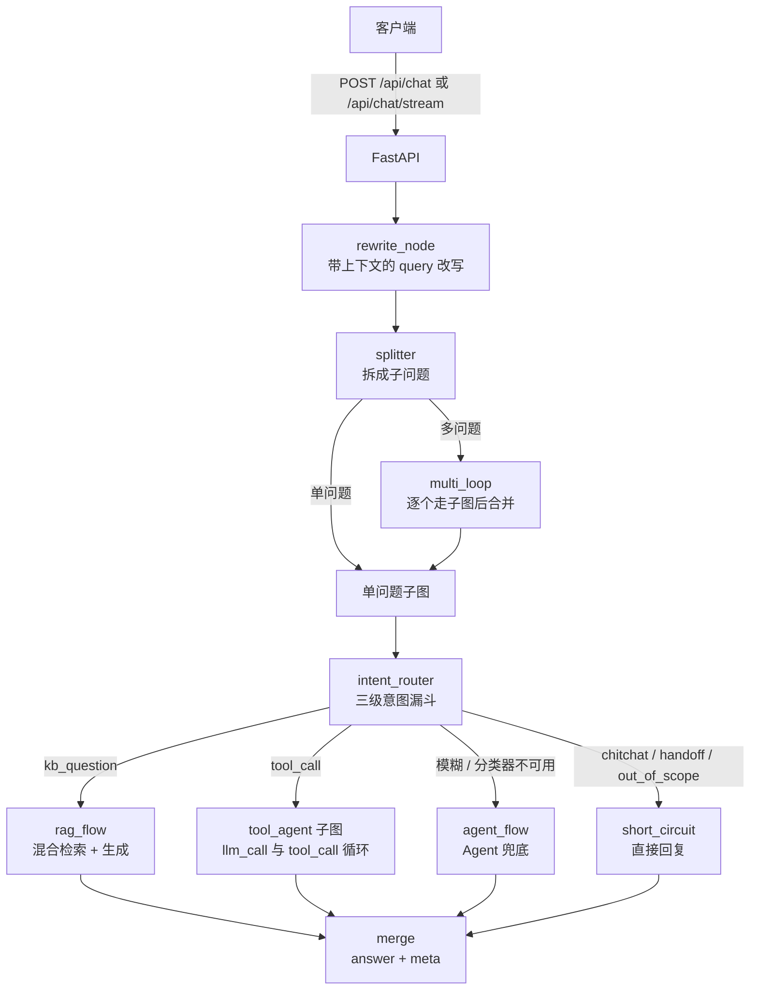
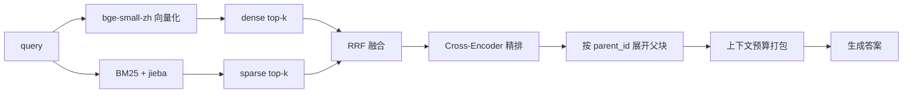

# 智能客服问答 API —— RAG 检索 + Agent 编排

面向智能家居售后场景的问答服务：**文档入库 → 混合检索 → 意图路由 → 生成/工具调用**，支持 SSE 流式输出。

项目重点不在"接一个大模型"，而在**检索质量可度量**与**失败路径可降级**：每个环节都有评估口径、有降级分支、有对应的回归测试。

| | |
|---|---|
| 检索层（165 条正样本标注集） | 精排后 **R@1 84.8% / R@20 98.2% / MRR 0.901** |
| 测试 | **331 个用例全绿**，零外部服务（不连 Redis / MySQL / 任何 LLM） |
| 入库 | 167 份文档 / 1761 个子块 / 98.4 秒，含 2 项安全探针 |
| 技术栈 | FastAPI · LangGraph · Chroma · BM25(jieba) · MySQL · Redis · DashScope · MCP |

---

## 它能做什么

- **多格式文档入库**：PDF（含扫描页 OCR 判定）/ DOCX（标题层级、表格窗口、内嵌图 OCR）/ XLSX（表头感知的窗口切分）/ TXT / Markdown，统一切成"父块 + 子块"两级结构。
- **混合检索**：向量召回（dense）+ 关键词召回（BM25），RRF 融合，Cross-Encoder 精排，最后按 `parent_id` 展开成父块 —— 打分用小而准的子块，喂给模型用带章节标题的父块。
- **三级意图漏斗**：规则 → Embedding 相似度 → LLM 结构化输出仲裁；只在歧义时才付出 LLM 的延迟与成本，任一层不可用都能降级而不是整条链失效。
- **Agent 工具调用**：4 个知识库工具（全库检索 / 限定文档检索 / 文档清单 / 章节概览）+ 通过 MCP 接入的外部工具，由 LangGraph 子图完成"调用-观察-再调用"循环。
- **多问题拆分与改写**：带上下文的 query 改写（短查询才触发，单号/型号原样保留）→ 拆成子问题 → 多问题逐个走完整流程后合并。
- **SSE 流式**：检索/生成阶段状态、真 token 增量、"部分内容未走流式"时的重置对账。
- **上下文预算**：按 token 估算打包检索结果，超出预算截断，而不是静默丢给模型触发 400。

---

## 实测效果

### 检索层（可复现）

174 条标注样本（165 正 / 9 负），语料 profile=L（171 个文件，含 4 个刻意准备的边界样本），本地 embedding + 本地精排：

| 通道 | 命中 | R@1 | R@3 | R@5 | R@20 | MRR |
|---|---|---|---|---|---|---|
| dense（bge-small-zh + Chroma） | 120/165 | 41.2% | 53.3% | 57.0% | 72.7% | 0.492 |
| BM25（jieba） | 159/165 | 70.3% | 87.3% | 93.3% | 96.4% | 0.799 |
| RRF 融合 | 162/165 | 52.7% | 77.0% | 89.7% | **98.2%** | 0.676 |
| **+ 精排** | 162/165 | **84.8%** | **93.9%** | **96.4%** | **98.2%** | **0.901** |
| + 父块扩展 | 161/165 | 84.8% | 93.9% | 96.4% | 97.6% | 0.901 |

分桶看精排的价值（R@1，融合后 → 精排后）：

| 分桶 | n | RRF R@1 | 精排 R@1 |
|---|---|---|---|
| 原词（文档里的词） | 9 | 77.8% | 66.7% |
| 口语改写（同义不同词） | 8 | 37.5% | **75.0%** |
| 跨文档（区分相近条目） | 9 | 44.4% | **66.7%** |
| 编号检索（唯一 ID 查找） | 139 | 52.5% | 87.8% |

时延（p50 / p90，毫秒）：向量化 72 / 136 · dense 10 / 14 · BM25 10 / 17 · **精排 1632 / 5882**

> **怎么读这张表（很重要）**
> 1. 融合把 R@20 从 96.4% 拉到 98.2%、补住了 dense 的短板，但 **R@1 反而低于 BM25 单路**（52.7% vs 70.3%）；靠精排把 R@1 拉回 84.8%。也就是说**融合负责召回上限，精排负责排序质量**，两件事不能混着看。
> 2. 精排增益最大的正是两个最难的桶（口语改写 37.5%→75.0%、跨文档 44.4%→66.7%），这正是它该起作用的场景。
> 3. 样本分布偏"编号检索"（139/165），总指标主要由该桶决定；原词/口语改写/跨文档三桶各只有 8~9 条，**只能看趋势，不能当结论**。
> 4. 这一步是**纯检索层**评测，不含生成正确率，也不含路由层。

判定精度是 **chunk 级**而不是文件级：标注集里每条样本都带 `anchor`（必须是该 chunk 原文的精确子串），脚本启动时先校验锚点再算指标 —— 否则一个占 39/53 块的大文件会让 R@20 虚高到接近 1。方法论详见 [`eval/README.md`](eval/README.md)。

### 入库与安全探针

| 项 | 结果 |
|---|---|
| 应当成功的文档 | 167 / 167 全部成功（`failed_expectations` 为空） |
| 子块总数 | 1761 |
| 全量入库耗时 | 98.4 秒 |
| 刻意准备的 4 个边界样本 | 全部按预期表现：截断 PDF 与 GBK 编码文本 → 500 并留痕；空文件 → 200 且 0 块；不支持的格式（`.png`）→ 明确报错而不是静默入库 |
| 安全探针 1：路径穿越（`../../evil.pdf`） | 拒绝（400），知识库外无写入 |
| 安全探针 2：超大文件（51MB，上限 50MB） | 拒绝（413），无残留 `.part` 文件 |

---

## 架构

### 请求编排（LangGraph 三层图）



### 检索链路



### 模块职责

| 目录 | 职责 |
|---|---|
| `api/` | HTTP 接口：`/api/chat`、`/api/chat/stream`（SSE）、`/api/upload` |
| `agent/graph.py` | LangGraph 三层图：主图（改写→拆分→单/多问题）、单问题子图（意图→分支→汇总）、工具子图（LLM⇄工具循环） |
| `intent/` | 三级意图漏斗 + 意图/槽位数据结构 |
| `rag/rag.py` | 解析（PDF/DOCX/XLSX/图内 OCR）、父子切分、双路召回、RRF、精排、父块扩展、入库与状态 |
| `rag/local_embedding.py` · `rag/local_reranker.py` | 本地 embedding 与 Cross-Encoder 精排（懒加载，启动不加载 torch） |
| `query_rewrite/` | 改写（带会话历史、短查询闸门）+ Redis 历史读写 |
| `tools_agent/` | 知识库工具（4 个）+ 工具调用模型 + 工具分派 |
| `context_budget.py` | token 估算、预算打包、溢出识别 |
| `db/` · `redis_client.py` | MySQL 文档/父子块存储 · Redis 会话历史与转人工计数窗口 |
| `mcp_client.py` | 外部 MCP 服务接入，工具统一命名空间 `mcp__<server>__<tool>` |
| `eval/` | 语料生成器（固定 seed）、批量入库、检索召回评测脚本 |
| `tests/` | 331 个用例，全部零外部服务 |


## 目录结构

```
my-agent-api/
├── main.py                 # 入口（uvicorn 127.0.0.1:8000）
├── config.py               # 配置集中入口
├── context_budget.py       # token 预算与打包
├── mcp_client.py           # MCP 外部工具接入
├── router/                 # 路由注册
├── api/                    # chat / chat_stream / upload
├── agent/                  # LangGraph 三层图 + 流式事件旁路
├── intent/                 # 三级意图漏斗
├── query_rewrite/          # 改写 + 会话历史
├── rag/                    # 解析 / 切分 / 检索 / 精排 / 生成
├── tools_agent/            # 知识库工具 + 工具调用模型
├── db/                     # MySQL 存储层 + schema.sql
├── eval/                   # 语料生成 + 批量入库 + 召回评测
└── tests/                  # 331 个用例
```
